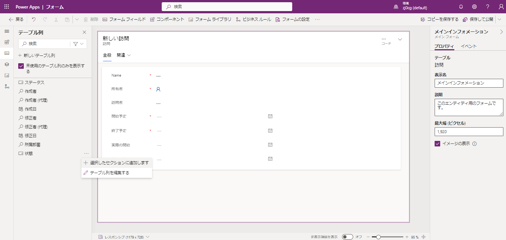
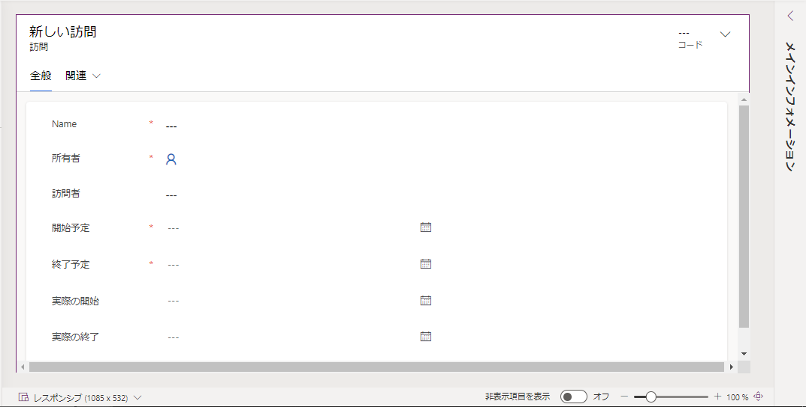

---
lab:
  title: 課題 3:モデル駆動型アプリをビルドする方法
  module: 'Module 3: Get started with Power Apps'
ms.openlocfilehash: a5176245ed8ec696049d78e1022e82aa8236057f
ms.sourcegitcommit: 8a89b7eacd1a65eaa7c5d6bff0dc7254991c4dde
ms.translationtype: HT
ms.contentlocale: ja-JP
ms.lasthandoff: 07/15/2022
ms.locfileid: "147154421"
---
# ラボ 3:モデル駆動型アプリをビルドする方法

## シナリオ

ベローズ カレッジは、キャンパス内に複数の建物を持つ教育機関です。 キャンパスの訪問者は現在、紙の日誌に記録されています。 その情報は一貫して把握されておらず、キャンパス全体の訪問に関するデータを収集して分析する手段もありません。

キャンパスの管理者は、建物へのアクセスがセキュリティ担当者によって管理され、すべての訪問者がホストによって事前に登録され、記録されることが要求される訪問者登録システムを近代化したいと考えています。

このコース全体を通して、アプリケーションを構築するとともに自動化を行って、ベローズ カレッジの管理担当者とセキュリティ担当者がキャンパス内の建物へのアクセスを管理および制御できるようにします。

このラボでは、Power Apps のモデル駆動型アプリを作成し、バックオフィスのキャンパス スタッフがキャンパス全体の訪問レコードを管理できるようにします。

ラボ手順の概要

モデル駆動型アプリを作成する一環として、次の手順を実行します。

- "キャンパス管理" という名前の新しいモデル駆動型アプリを作成する

- アプリのナビゲーションを編集して必要なテーブルを参照する

- アプリに必要なテーブルのフォームとビューをカスタマイズする

次のコンポーネントを操作します。

- **ビュー**:ビューを使用すると、ユーザーはフォーム テーブルに既存のデータを表示できます。

- **フォーム**: ここで、ユーザーはテーブル内の新しい行を作成または更新します。

両方のコンポーネントは、より良いユーザー エクスペリエンスのためにモデル駆動型アプリに統合されます。

前提条件

- **モジュール 0 ラボ 0 - ラボ環境の検証** の完了
- **モジュール 2 ラボ 1 - データ モデリング** の完了

始める前に考慮すべきこと

- ユーザー エクスペリエンスを向上させるためにどのような変更を加える必要がありますか。
- 構築したデータ モデルに基づいて、モデル駆動型アプリに何を含める必要がありますか?
- モデル駆動型アプリのサイトマップで行うことができるカスタマイズは何ですか。

## 演習 1:ビューとフォームのカスタマイズ

**目的:** この演習では、モデル駆動型アプリで使用されるカスタム作成されたテーブルのビューとフォームをカスタマイズします。

### タスク \#1:訪問フォームを編集する

1. まだサインインしていない場合は、[https://make.powerapps.com](https://make.powerapps.com/) にサインインします。

2. **[[自分のイニシャル] 練習]** 環境がまだ選択されていない場合は、右上で選択します。

3. 左側のナビゲーションから、 **[テーブル]** を選択して **[訪問]** テーブルを開きます。

訪問テーブルが表示されない場合は、正しい環境であることを確認します (手順 2)。

4. **[+ 新規]** - **[データ エクスペリエンス]** セクションで、 **[フォーム]** を選択し、 **[メインフォーム]** をクリックして訪問メインフォームを開きます。

**重要:** フォームに次の 2 つのフィールド[名前] と [所有者]があることを確認してください。

5. 画面の右側の [プロパティ] パネルで、**[表示名]** フィールドを選択し、それを **[メインインフォメーション]** に変更します。

6. 左側にあるテーブル列のフィールド右に表示されるに「...」をクリック、「＋選択したセクションに追加します」をクリックする

    1. 訪問者

    2. 開始予定

    3. 終了予定

    4. 実際の開始

    5. 実際の終了

7. **[コード]** 列をドラッグして、フォームヘッダーにドロップします。

ヘッダーはフォームの右上の領域です。 フォームのフィールドを表示するには、必要に応じて画面の右側にある [プロパティ] パネルを折りたたみます。

8. **[コード]** フィールドを選択したまま、画面の右側にある [プロパティ] パネルで、 **[読み取り専用]** のチェックボックスをオンにします。

9. **[所有者]** を選択します。 [プロパティ] パネルで、**[ラベル]** を **[ホスト]** に変更します

10. 右上の **[保存して公開]** をクリックして、保存および公開が完了するまで待ちます。

12. 編集ビューが新しいブラウザー タブまたはウィンドウで開いている場合は、それを閉じます。 それ以外の場合は、画面左上の **[戻る]** をクリックします。 これで、訪問テーブルの [フォーム] に戻るはずです。

13. 画面左上の **[戻る]** をクリックすると、**[訪問]** テーブルのメイン画面(**[テーブル] > [訪問]** )に戻ります。

### タスク \#2:アクティブな訪問 ビューを編集する

このタスクでは、既定の [アクティブな訪問] ビューを変更して、今日の訪問についての新しいビューを作成します。

1. **[データ エクスペリエンス]** セクションで、 **[ビュー]** を選択し、 **[アクティブな訪問]** ビューをクリックして開きます。

2. フィールドをクリックして、次のフィールドをビューに追加します。

    1. **コード**

    2. **訪問者**

    3. **開始予定**

    4. **終了予定**

3. **[作成日]** 列をクリックし、**[削除]** を選択します。 **作成日** 列がビューから削除されます。

4. データに合わせて列幅を変更します。

5. **[保存して公開]** をクリックし、変更が保存されるまで待ちます。
重要: [アクティブな訪問] ビューは、「タスク #3」で利用するため、閉じないようにしてください。

### タスク #3:今日の訪問についての新しいビューを作成する

ここで、ビューをクローンして、今日の訪問についての新しいビューを作成します。

1. **[名前を付けて保存]** を選択します。

2. 名前を **[今日の訪問]** に変更し、**[上書き保存]** を押します。

3. [プロパティ] パネルで **[フィルター基準]** の **[フィルターの編集]** をクリックします。

4. **[追加]** をクリックし、**[行の追加]** を選択します。

5. **"開始予定"** をフィールドとして選択し、**[今日]** をドロップダウンの条件として選択します。

6. **[状態]** が表示されている行の「…」をクリックし、 **[削除]** をクリックして、そのフィルター条件を削除します。

7. **[OK]** をクリックして、条件を保存します。 このビューは、スケジュールされた開始日が今日のレコードのみを表示するようにフィルター処理されます。

8. **"実際の開始"** フィールドと **"実際の終了"** フィールドをビューに追加します。

**注1:**  8で2つのフィールドを追加した後、「ここに表示する項目が見つかりません」と表示されますが問題ありません。

**注2:**  ビューの状態をフィルター処理しないため、完了した訪問を含む今日の訪問をすべて取得します。 これらのフィールドは、完了した訪問と進行中の訪問を区別するのに役立ちます。

1. **[保存して公開]** をクリックし、変更が保存されるまで待ちます。

## 演習 2:モデル駆動型アプリを作成する

**目的:** この演習では、モデル駆動型アプリを作成し、サイトマップをカスタマイズして、アプリをテストします。

わかりやすくするため、また時間の都合上、このラボでは一部の [訪問] 列については説明しません。

### タスク \#1:アプリを作成する

1. [https://make.powerapps.com](https://make.powerapps.com/) にサインインします (まだサインインしていない場合)。

2. **[自分のイニシャル] 練習** 環境がまだ選択されていない場合は、右上で選択します。

3.  画面の左側にある **[ホーム]** アイコンをクリックします。

3. モデル駆動型アプリケーションを作成します。

    1. ホーム画面の **[空のアプリ]** を選択します。

    1. **[Dataverse ベースの空のアプリ]** で、 **[作成]** を選択します。

    1. [名前] に「**Bellows Campus 管理**」と入力し、**[作成]** を選択します。

4. 新しいモデル駆動型アプリケーションが読み込まれたら、**[+ ページの追加]** ボタンを選択します。

5. 表示される画面で **[Dataverseテーブル]** を選び、 **[次へ]** を選択します。

6. 次のテーブルを追加します。

    1. 訪問

    1. 取引先担当者

7. この 2 つのテーブルを選択したら、**[追加]** を選択します。

9. ナビゲーション ウィンドウで、ナビゲーション と表示されている項目の下にある **[セキュリティ]** を選択します。

10. 画面の右側にある **[表示オプション]** セクションで、 **[タイトル]** プロパティを **[セキュリティ]** に変更します。

11. **[保存して公開]** をクリックし、変更が保存されるまで待ちます。

### タスク #2:アプリケーションをテストする

1. アプリケーションの起動

    1. **[取引先担当者フォーム]** を選択し、 **[再生]** を選択して、新しいウィンドウでアプリを開きます。

2. 新しい取引担当者を作成します

    1. アプリでは、 **[自分のアクティブな取引担当者]** ビューが開きます。 そうでない場合は、左側のナビゲーションで [取引担当者] を選択します。

    1. トップ メニューで **[新規]** をクリックします。

    1. **[名]** に「太郎」、**[姓]** に「山田」と入力します。

    1. **[電子メール]** に **[配布したMicrosoftアカウントのメールアドレス]** を指定します。 これは、メールを受信する今後のラボで使用されます。

    1. **[保存して閉じる]** をクリックします。

    1. これで、 **[自分のアクティブな取引担当者]** ビューに作成された連絡先が表示されるはずです。

3. 新しい訪問を作成します

    1. サイトマップの左側のナビゲーションから **[訪問]** を選択します。

    1. **[+ 新規]** をクリックします。

    1. 次のフィールドを入力します。

        1. **[名前]** : 新しいテスト訪問

        1. **訪問者**: 山田太郎 を選択します

        1. **開始予定**: 開始時刻として、今日の日付と午後 2:00 を選択します

        1. **終了予定**: 終了時刻として、今日の日付と午後 3:30 を選択します

- **[保存して閉じる]** をクリックします。 これにより訪問が作成され、**[アクティブな訪問ビュー]** に表示されるようになります。

- ビューを **[今日の訪問]** に変更します。 新しい訪問は明日に予定されているため、ビューに表示されなくなります。

4. さらにテスト レコードを追加できます。

起動中のアプリは次のようになります。

お疲れさまでした。 最初のモデル駆動型アプリの作成と構成を完了しました。

## 課題

- 連絡先の特定のビューやフォームを選択してみましょう

[次の章へ(ラボ4)](https://github.com/hamabe-12/PL-900/blob/main/Instructions/Labs/LAB%5BPL-900%5D_M04Lab01_Power_Automate.md)